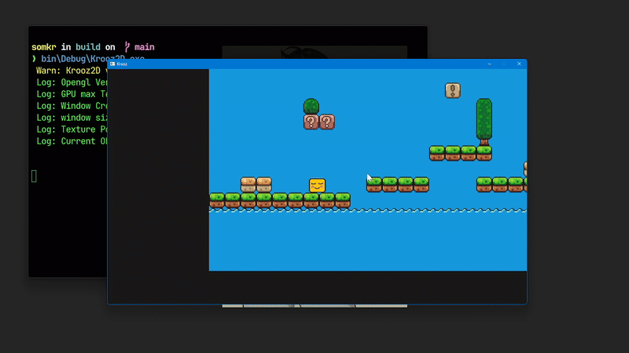

> **Krooz2D** is an ECS-based lightweight **2D mini-engine / graphics library** written in **C++ + OpenGL**.  
> This project is primarily a **learning journey** into OpenGL, graphics programming, and game-engine architecture.

---

##  Example

A minimal example demonstrating **entity creation**, **collision handling**, **rendering**, and **input processing**.


```cpp
#include "Core/Window.h"
#include "Core/Macros.h"
#include "Core/StateManager.h"
#include "Core/Camera.h"
#include "Core/Input.h"

#include "Components/TextureComponent.h"
#include "Components/TiledComponent.h"
#include "Components/CollisionComponent.h"

#include "Systems/RenderSystem.h"
#include "Systems/CollisionSystem.h"

int main() {

    createWindow(1280, 720, "Krooz");

    World world;
    SetWorldContext(world, WorldMode::PLATFORMER);

    LoadTexture(boxy, "Assets/boxy.png");
    LoadTexture(map, "Assets/map.png");
    TiledComponent::LoadTiled("Assets/Tiled.json");

    Ent Map = CREATE();
    WITH(Map) {
        ADD(TextureComponent, map);
        GET(TransformComponent).SetScaleVec(Vec2(map->width, map->height));
    }

    Ent Player = CREATE();
    WITH(Player) {
        ADD(TextureComponent, boxy);
        GET(TransformComponent).SetScaleVec({20, 16});
        GET(TransformComponent).SetPosition({100, 100});
        ADD(CollisionComponent, CollisionType::DYNAMIC);
        ADD(RigidBodyComponent);
    }

    Camera camera;
    Input::SetInitialScroll(3.0f);

    SetActiveSystemList(RenderSystem, CollisionSystem);

    WITH(Player) {
        camera.SetTarget(&GET(TransformComponent));
    }

    while (!windowShouldClose()) {

        DeltaContext(dt);
        BeginDraw;

        camera.setZoom(Input::ScrollFactor(), dt);
        camera.Follow(dt);
        clearColor(KroozColor::KROOZMIST);

        if (IsPressed(KEY_d)) {
            world.get<TransformComponent>(Player.id).AddOffset({100 * dt, 0});
        }
        if (IsPressed(KEY_a)) {
            world.get<TransformComponent>(Player.id).AddOffset({-100 * dt, 0});
        }
        if (IsPressed(KEY_space) && world.get<RigidBodyComponent>(Player.id)._onGround) {
            world.get<RigidBodyComponent>(Player.id)._vel.y = -400.0f;
        }

        UpdateSystems;
        EndDraw;
    }

    closeWindow();
    return 0;
}
```
#### ⚠️ Work in progress — active development APIs, structure, and features will change frequently.
